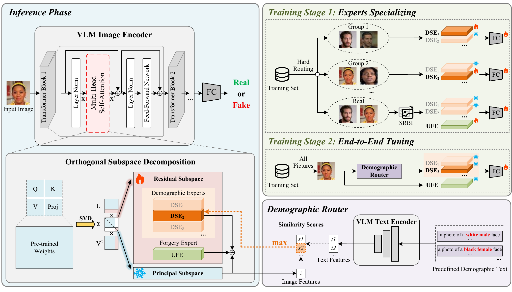

# Breaking the Trade-off: Orthogonal Semantic Decoupling for Generalizable and Fair Deepfake Detection

Zhongyu Shi, Siyu Peng, Yimin Kang, Ruiyang Xia, Yizhi Fang, Weiping Wen<sup>*</sup>, Zeyu Gu, and Sai Cheng

This repository is the official implementation of our paper "Breaking the Trade-off: Orthogonal Semantic Decoupling for Generalizable and Fair Deepfake Detection", which has been accepted by IJCAI 2026.



## Requirements

- Linux
- Python 3.10+
- PyTorch 2.0+
- CUDA 11.8+

## Installation

```bash
conda create -n osd python=3.10 -y
conda activate osd

# Install the PyTorch build that matches your CUDA version.
conda install pytorch torchvision pytorch-cuda=11.8 -c pytorch -c nvidia

pip install -r requirements.txt
```

Download CLIP ViT-L/14 weights from your preferred model hub and update `CLIP_path` in `configs/osd.json`.

## Data Preparation

The datasets and gender/race annotations used in our experiments are obtained from [Fairness-Generalization](https://github.com/Purdue-M2/Fairness-Generalization).

## Configuration

Edit `configs/osd.json` before running experiments:

```json
{
  "CLIP_path": "/path/to/clip-vit-large-patch14",
  "num_experts": 7,
  "rank_per_expert": 8,
  "moe_lambda_orth": 0.001,
  "zero_shot_tau": 0.1,
  "stage1_base_dir": "outputs/2026-1-15/osd",
  "experts_map": {
    "0": "checkpoint-last.pth",
    "1": "checkpoint-last.pth",
    "2": "checkpoint-last.pth",
    "3": "checkpoint-last.pth",
    "4": "checkpoint-last.pth",
    "5": "checkpoint-last.pth",
    "6": "checkpoint-last.pth"
  }
}
```

`stage1_base_dir` should point to the saved Stage 1 expert checkpoints before Stage 2 training.

## Training and Evaluation

Edit dataset and output paths in `scripts/train.sh`, then run:

```bash
bash scripts/train.sh
```

Training uses two stages:

1. Stage 1: train each expert with hard sampling on its designated training data.
2. Stage 2: fine-tune the classification head with zero-shot routing.

All stages run for the configured number of epochs without validation-based model selection. Each expert and the Stage 2 classification head are saved as `checkpoint-last.pth` after the final epoch.

Edit checkpoint and dataset paths in `scripts/test.sh`, then run:

```bash
bash scripts/test.sh celebdf
```

The default evaluation base is `data/test`, so `bash scripts/test.sh celebdf` evaluates `data/test/celebdf`.

## Citation

If you find our work useful, please cite our paper:

```bibtex
@inproceedings{shi2026osd,
  title={Breaking the Trade-off: Orthogonal Semantic Decoupling for Generalizable and Fair Deepfake Detection},
  author={Zhongyu Shi and Siyu Peng and Yimin Kang and Ruiyang Xia and Yizhi Fang and Weiping Wen and Zeyu Gu and Sai Cheng},
  booktitle={Proceedings of the Thirty-Fifth International Joint Conference on Artificial Intelligence (IJCAI)},
  year={2026}
}
```

## License

This project is released under the [MIT License](LICENSE).
